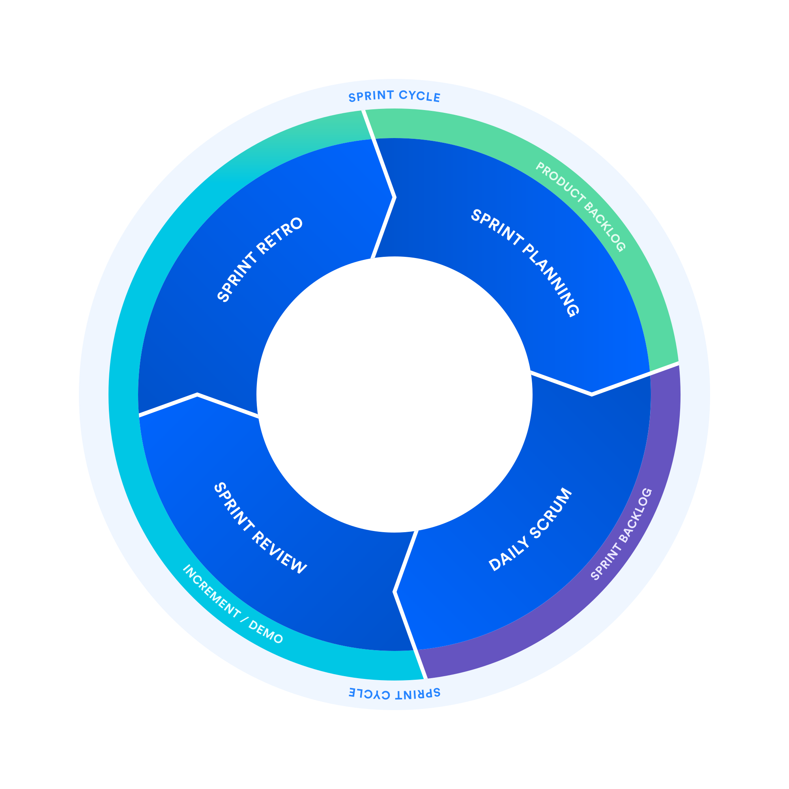

# O que é o scrum?
o scrum é uma metodologia de trabalho que auxilia equipes trabalharem juntas.

# O que são Sprints?
é um periodo curto e fixo que uma equipe trabalha para concluir uma quantidade definida de tarefas.

"Com o Scrum, um produto é criado em uma série de iterações, chamadas sprints, que dividem projetos grandes e complexos em pedaços pequenos", declara Megan Cook, Gerente de Produtos de Grupo do Jira Software na Atlassian."

# Como planejar e executar sprints de scrum

## O ciclo da sprint

1. Planejamneto da Sprint (Sprint Planning)
é um evento colaborativo em que a equipe responde as perguntas: o que pode ser feito nessa sprint, como vai ser feito e quem vai fazer.

    - O que é Product backlog?
        - product backlog, também chamado de lista de dependencias ou historias, é basicamente uma lista de tarefas/trabalho que deve ser realizado em ordem de prioridade. Os itens de mais prioridade estão no topo da lista.
    - caso a sprint seja de duas semanas ou mais é recomendado fazer o refinamento do backlog. Essa etapa é opcional, mas importante para a maioria da equipes e deve ser feito antes de iniciar o planejamento da sprint.
    - outro ponto importante é definir um tempo limite para o planejamneto da sprint, o recomendado é de duas horas por semana da sprint.
  
1. Backlog da Sprint: 
   * na reunião são escolhidos os itens de trabalho (tarefas) do  <a href='https://www.atlassian.com/br/agile/scrum/backlogs'> Product backlog</a> que podem ser feitos nessa sprint e um plano de como conseguir conclui-los. esse itens selecionados são chamados organizados em uma lista chamada de  backlog da sprint .

2. Em andamento
    * Lista usada para alocar itens a fazer do Sprint Backlog. Aqui é onde cada membro da equipe coloca uma tarefa que foi designado a faze-la.

3. Concluido
    - Lista Usada para alocar os itens que ja foram concluidos

## Acknowledgements

* https://scrumguides.org/scrum-guide.html
* https://www.atlassian.com/br/agile/scrum/
